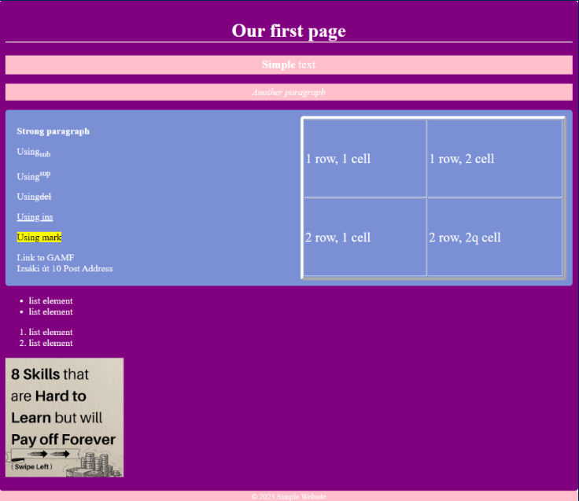

# Simple Website

Welcome to the Simple Website repository! This project is designed for learning the basics of HTML and CSS. The repository contains a small, well-structured website that you can use to practice and enhance your web development skills.

## Features

- **HTML**: 57.3% of the project is written in HTML, providing a solid foundation for structuring web content.
- **CSS**: 35.3% of the project is styled using CSS, demonstrating various styling techniques.
- **JavaScript**: 7.4% of the project includes JavaScript to add interactivity.

Feel free to explore the code, make improvements, and learn from this simple yet effective project.

Happy coding!
